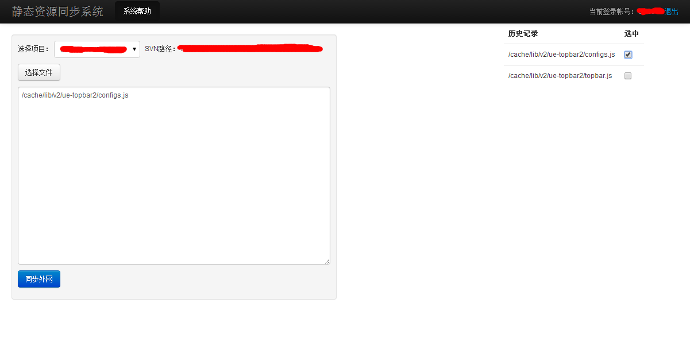

OneAboveAll
===========

chrome插件,自动加载自定义脚本到匹配页面中.  
这样你就可以用自定义脚本来增强页面的一些功能,或者根据你自己的特殊癖好来对页面进行调教.

###为什么做这个

工作中需要用到非常多的内部系统,考勤、排期、CMS等等……

这些系统有的功能很简陋，使用起来很不方便，有的操作方式让我很不习惯。

去提需求肯定不现实，因此做了这个工具，用来给这些应用扩展一些自己需要的功能。

###如何使用

有空再写吧

###功能列表

目前只支持插入自定义脚本到页面，可以配置插入脚本的规则。 

暂不支持一些服务端功能，也不支持脚本的托管，可以使用免费七牛云存储来托管脚本。

###看看效果

这是将源代码上传到ftp的系统,每次都要找到要上传的文件,或者将文件地址粘帖到文本区域.  

对于正在开发测试阶段的项目,这样非常麻烦.因此简单的给这个系统扩展了一个历史记录的功能,只要勾选即可自动输入.

